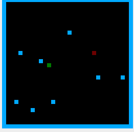

# 🐍 Snake Game - RISC-V Assembly


> Une implémentation classique du jeu Snake, écrite entièrement en langage d'assemblage RISC-V 32-bits, utilisant le Memory Mapped I/O (MMIO) pour le rendu graphique et la gestion des entrées.

---

### 📷 Aperçu



---

### 📋 Fonctionnalités

Ce projet a été codé "from scratch" sans moteur de jeu, gérant directement la logique bas niveau.

* **Déplacement fluide :** Gestion des entrées clavier via MMIO (Memory Mapped I/O).
* **Génération aléatoire :** La nourriture apparaît à des coordonnées pseudo-aléatoires.
* **Gestion des collisions :**
    * Détection des murs (Game Over).
    * Détection de la queue du serpent (Game Over).
* **Affichage Bitmap :** Rendu pixel par pixel via l'écriture directe en mémoire (Frame Buffer).

---

### 🛠️ Prérequis

Pour exécuter ce code, vous aurez besoin d'un simulateur RISC-V supportant l'affichage Bitmap.

* **Recommandé :** [RARS (RISC-V Assembler and Runtime Simulator)](https://github.com/TheThirdOne/rars)
* *Alternative :* Venus (si configuré correctement).

---

### 🚀 Installation et Lancement

1.  **Cloner le dépôt :**
    ```bash
    git clone https://github.com/mfc1609/snake.git
    ```

2.  **Ouvrir le projet :**
    Lancez **java -jar rars1_6.jar** et ouvrez le fichier principal (ex: `snake.asm`).

3.  **Configurer l'affichage (Bitmap Display) :**
    Dans RARS, allez dans `Tools > Bitmap Display`. Cette étape est **cruciale** pour voir le jeu :

    | Paramètre | Valeur (À vérifier dans le code) |
    | :--- | :--- |
    | **Unit Width** | 8 |
    | **Unit Height** | 8 |
    | **Display Width** | 256 |
    | **Display Height** | 256 |
    | **Base Address** | `0x10010000` (Static Data) |

4.  **Connecter et Lancer :**
    * Cliquez sur le bouton **"Connect to Program"** dans la fenêtre Bitmap Display.
    * Assemblez (F3) et lancez le programme (F5).

---

### 🎮 Contrôles

Le jeu utilise les touches du clavier mappées via le **MMIO Simulator** de RARS.

* **Z** : Haut
* **Q** : Gauche
* **S** : Bas
* **D** : Droite
* *(Note : Assurez-vous que le focus clavier est actif sur la fenêtre du simulateur)*

---

### 💻 Architecture Technique

Quelques détails sur l'implémentation pour les curieux :

* **Registres clés :**
    * `s0` : Tête du serpent (Coordonnées X/Y)
    * `s1` : Direction actuelle
    * `a0` - `a7` : Arguments de fonctions et appels système (Syscalls)
* **Mémoire :**
    * Le corps du serpent est stocké dans un tableau en mémoire statique.
    * L'affichage est géré en écrivant des couleurs hexadécimales (ex: `0x00FF00` pour le vert) aux adresses mémoire correspondantes.

---

### 👤 Auteur

**Mohamed Chouban**

* Github : [@mfc1609](https://github.com/ton-pseudo)
